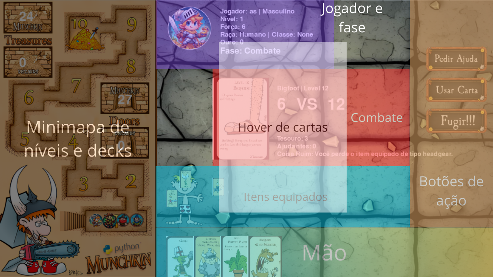

# Munchkin 1.0 - Uma Releitura Digital

Este projeto é uma adaptação digital do famoso jogo de cartas **Munchkin**. Munchkin é um jogo de cartas que mistura humor e aventura, onde jogadores competem para alcançar o nível mais alto enquanto enfrentam monstros, usam equipamentos poderosos e sabotam seus oponentes.

## 🕹️ Recursos do Projeto

- **Desenvolvido com PyGame**: Uma biblioteca poderosa para desenvolvimento de jogos 2D em Python.
- **Multiplayer Local**: Jogadores podem se enfrentar no mesmo dispositivo.
- **Multiplayer Online (Em Desenvolvimento)**: Uma futura atualização trará a possibilidade de jogar com amigos pela internet.

## 🎨 Interface do Jogo



### Explicação das Telas:
- **Tela Inicial**: Permite configurar os jogadores e iniciar uma nova partida.
- **Área de Jogo**: Exibe o tabuleiro, as cartas em jogo e os jogadores.
- **Transições e Animações**: Eventos importantes, como derrotar monstros ou rolar o dado, possuem animações dedicadas para maior imersão.

## 🔄 Diferenças do Jogo Base

Esta versão do Munchkin possui algumas alterações em relação ao jogo físico:

1. **Número de Cartas Reduzido**: Um baralho otimizado para partidas mais rápidas.
2. **Efeitos de Cartas Alterados**: Alguns efeitos foram simplificados ou limitados para melhor adaptação digital.
3. **Fase de Caridade Pós-Morte**: Distribuição automática de cartas sem escolha ao morrer.
4. **Raças Não Desequipáveis**: Ao ganhar uma raça, ela não pode ser removida.
5. **E Mais**: Outras mudanças para adaptar o jogo ao formato digital e simplificar a jogabilidade.

## 🚀 Como Rodar o Projeto Localmente

1. Instale o Pipenv:
   ```bash
   pip install pipenv
   ```

2. Instale as dependências do projeto:
   ```bash
   pipenv install
   ```

3. Execute o jogo:
   ```bash
   python main.py
   ```

## 📦 Como Gerar um Executável

1. Instale o PyInstaller:
   ```bash
   pip install pyinstaller
   ```

2. Gere o executável:
   ```bash
   pyinstaller --add-data "assets;assets" --onefile main.py
   ```

O executável gerado estará disponível na pasta `dist/`.
